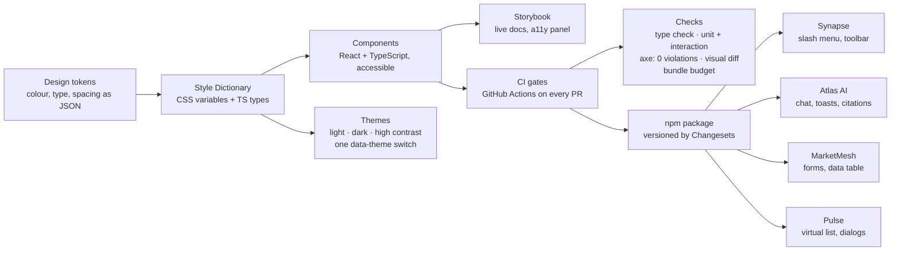

# Meridian

An accessible, tested, published React component library. It is the foundation the other four portfolio
projects (Synapse, Atlas AI, MarketMesh and Pulse) are built with.

> **Demo video (60–90 s):** _to be recorded and linked here_ · **Storybook:** _link after first deploy_ ·
> **npm:** `@meridian/react`, `@meridian/tokens`

**Try it in five steps**

1. **Open Storybook.** Every component is documented and reports zero accessibility violations.
2. **Switch themes.** Light, dark and high contrast, all driven by tokens.
3. **Unplug the mouse.** Tab through the combobox, dialog and menu. Focus is always visible.
4. **Break a button.** Visual regression flags the diff and CI blocks the merge.
5. **Ship it.** Merging publishes a new npm version with a changelog.

## Architecture



**From a token change to every app**

1. A change, such as a brand colour, is made once in the token JSON.
2. Style Dictionary regenerates the CSS variables and TypeScript types. Every theme picks them up.
3. The pull request runs type checks, unit and interaction tests, axe, visual diffs and bundle budgets.
   Any failure blocks the merge.
4. On merge, Changesets bumps the version, writes the changelog and publishes to npm with provenance.
5. The four apps update the package and inherit the change.

## What is in it

- **Tokens** for colour, type, spacing, radius, shadow, motion and z-index, from one JSON source.
- **Three themes** switched by a `data-theme` attribute. A colour change never triggers a React re-render.
- **31 component folders** in four tiers. Each tier only uses the tiers below it.

| Tier        | Components                                                                                                                                  |
| ----------- | ------------------------------------------------------------------------------------------------------------------------------------------- |
| Patterns    | DataTable (virtualized), CommandPalette, FormField, EmptyState                                                                              |
| Composites  | Combobox, Dialog, Popover, Menu, Tabs, Tooltip, Toast, Accordion, Alert, Card, Breadcrumbs                                                  |
| Primitives  | Button, IconButton, Input, Textarea, Checkbox, Radio, Switch, Select, Badge, Avatar, Spinner, Skeleton, Separator, Progress, VisuallyHidden |
| Foundations | Tokens, themes, icons                                                                                                                       |

- **Keyboard first:** roving focus, focus traps and a visible focus ring everywhere.
- **Four kinds of tests:** unit, interaction, accessibility and visual regression.
- **Automated releases** with a changelog, and a contribution guide ([CONTRIBUTING.md](CONTRIBUTING.md)).

A compound API keeps components flexible while the library owns the accessibility wiring:

```tsx
<Combobox value={person} onChange={setPerson}>
  <Combobox.Label>Assign to</Combobox.Label>
  <Combobox.Input placeholder="Search people" />
  <Combobox.List>
    {people.map((p) => (
      <Combobox.Option key={p.id} value={p}>
        {p.name}
      </Combobox.Option>
    ))}
  </Combobox.List>
</Combobox>
```

Roles, ids, `aria-activedescendant` and arrow-key handling are set up inside, so consumers cannot get them wrong.

## Key decisions

Short records of why, with the options that were rejected, live in [docs/adr](docs/adr):

- [0001](docs/adr/0001-css-variables-over-css-in-js.md) CSS variables over runtime CSS-in-JS
- [0002](docs/adr/0002-changesets-for-releases.md) Changesets over manual versioning
- [0003](docs/adr/0003-react-aria-for-combobox-and-menu.md) React Aria for the hardest widgets, hand-built for the rest
- [0004](docs/adr/0004-compound-components.md) Compound components for composite widgets

## Benchmarks and how to reproduce them

Measured on an Apple M4 Pro, macOS 27, Node 26, headless Chromium from Playwright 1.64.0, against the static
Storybook build. Nothing is estimated; each row says where it came from.

| Target                                    | Result                                                          | How it was measured                     |
| ----------------------------------------- | --------------------------------------------------------------- | --------------------------------------- |
| axe violations across all stories         | **0** (88 stories × 3 themes = 264 runs)                        | `npm run e2e -w @meridian/docs -- a11y` |
| Lighthouse accessibility on the docs site | **100** (3 of 3 runs)                                           | `npx lhci autorun`                      |
| Test coverage on component logic          | **94.2%** lines, 81.1% branches, 115 tests                      | `npm run test:coverage`                 |
| Interactive parts usable by keyboard      | Every interactive component has keyboard tests (unit + browser) | `e2e/keyboard.spec.ts`, `*.test.tsx`    |
| Token contrast, WCAG 1.4.3 / 1.4.11       | **105 pairings pass** in all 3 themes                           | `npm run contrast`                      |
| Bundle size, whole library                | **15.3 kB** minified + brotli                                   | `npm run size`                          |
| Bundle size, one component (Button)       | **0.9 kB** minified + brotli                                    | `npm run size`                          |
| Bundle budget per component               | Enforced: 2 kB, up to 5 kB for DataTable / CommandPalette       | `.size-limit.json`                      |
| Visual regression sensitivity             | A one-line radius change on Button flagged **64** screenshots   | zero-tolerance diff, see below          |

Sizes exclude `react`, `react-dom` and `react-aria-components`, which are peers or installed once.

**Visual regression, honestly.** A pixel threshold that is too loose hides small changes. The first setting
(0.2% of the page) did not notice a changed button radius, so it is now zero pixels with fonts pinned and
animations off. It passed twice in a row unchanged and failed when Button's radius was changed. Screenshots
vary by OS, so baselines are generated in the Playwright container (`Update visual baselines` workflow) and
the CI visual step runs once they are committed.

**Not yet measured:** real npm download numbers (nothing is published yet) and a screen reader walkthrough on
real devices. Run the manual checklist in Storybook under **Guides / Accessibility** before a release.

Reproduce everything:

```bash
npm install && npm run build
npm run contrast && npm run typecheck && npm run test:coverage && npm run size
npm run build:docs
npm run e2e -w @meridian/docs -- a11y keyboard
npx lhci autorun
```

## Failure modes

| What breaks                                | What happens                                                                              |
| ------------------------------------------ | ----------------------------------------------------------------------------------------- |
| `localStorage` is blocked or full          | `ThemeProvider` still works for the session; it just cannot remember the choice           |
| JavaScript is slow to load                 | `getThemeInitScript()` applies the saved theme before first paint, so there is no flash   |
| Rendered on the server                     | No `window` access at import time; ids come from `useId`; portals mount after hydration   |
| A compound part is used outside its parent | Throws a readable error naming both parts instead of failing silently                     |
| An avatar image fails to load              | Falls back to initials, and the accessible name stays the person's name                   |
| `prefers-reduced-motion: reduce`           | Animations and transitions are removed or slowed                                          |
| `forced-colors` (Windows high contrast)    | Borders and focus use system colours where tokens would be overridden                     |
| A pull request forgets a changeset         | The changeset check fails the pull request                                                |
| The npm publish step fails                 | The version pull request stays open; nothing is half-published, and the job can be re-run |

## Run it locally

```bash
nvm use && npm install
npm run build        # tokens, then the library
npm run storybook    # http://localhost:6006
npm test             # unit, interaction and axe tests
```

## What changes at 10x and 100x

- **More teams (10x).** Add the remaining brands as extra theme files; the build already compiles one CSS block
  per theme. Publish a codemod with every major release and keep deprecations for one minor.
- **Many teams (100x).** Move to per-package releases (one per component group) so a fix does not force a
  full upgrade. Shard the visual suite across runners, or move it to a hosted service. Add usage analytics
  to learn which components and props are safe to remove.
- **Bigger tables.** The DataTable already renders only the visible rows. Next steps would be column
  resizing, pinned columns and server-driven sorting, all through the existing controlled props.
- **Right-to-left and localisation.** Switch margins and positions to logical properties, and move the few
  built-in strings (such as "Dismiss notification") behind a messages prop.

## Threat model

- **Supply chain.** Releases are published from CI with npm provenance. Dependabot and `npm audit` run in CI,
  and the publish token is only available to the release workflow.
- **Script injection.** `getThemeInitScript` is a fixed string; the storage key is passed through
  `JSON.stringify`. Components never use `dangerouslySetInnerHTML` with consumer input.
- **Consumer data.** The library makes no network calls and stores only the theme name in `localStorage`.

## Repository layout

```
design-system/
├─ packages/
│  ├─ tokens/            tokens JSON + Style Dictionary build, contrast check
│  └─ react/src/components/Combobox/
│     ├─ Combobox.tsx          component + compound parts
│     ├─ Combobox.module.css   styles from CSS variables
│     ├─ Combobox.test.tsx     behaviour + axe checks
│     └─ Combobox.stories.tsx  docs, controls, visual tests
├─ apps/docs/             Storybook site + Playwright axe, keyboard and visual tests
├─ docs/adr/              decision records
├─ .changeset/            release notes per change
└─ .github/workflows/     ci.yml, release.yml
```

## License

MIT
